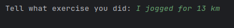
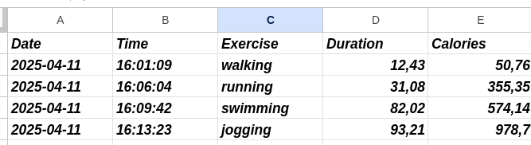

# Activity-Tracker
 <h2>Saving activity into Google Sheets using Sheety and Natural Language API's</h2>
 
<h3>example:</h3> 

<h3>result is then written into google sheet:</h3> 

  <h3>Usage</h3> 
<h3>In directory 'keys' paste following things into files:<h3>
app-id.txt : your app id from nutritionix website  
app-key.txt : your app key from nutritionix website  
sheet.txt : API POST method from sheety that corrresponds to your google sheet  
sheety_token.txt : paste 'Bearer your_key' into file from Authentication tab in Sheety   